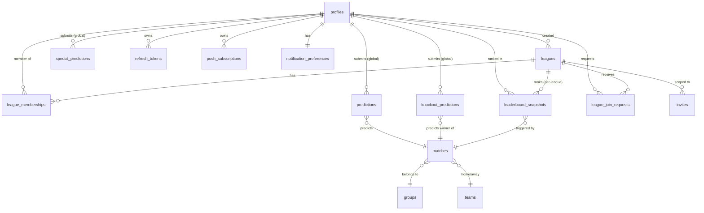

# Multi-League Architecture (v1)

**Status:** Design landed 2026-05-27 · awaiting sign-off · implementation phases M1–M8
**Author:** planning session 2026-05-27 (Opus 4.7, extended thinking)
**Supersedes:** the implicit single-league model in `wc2026-architecture.md`
**Relationship to v1 architecture:** this document is **additive** — `wc2026-architecture.md` remains authoritative for tournament fixtures, scoring rules (§6.1), time/timezone handling, the match state machine (§6.13), and all reliability/observability behaviour. Multi-league concerns layer on top.

---

## 1. Overview and Goals

The Steele Spreadsheet System ships v1.0 as a single-league predictor. This document specifies the v1 of multi-league: turning the app into a small platform where a player has a persistent identity across many leagues, can create or discover leagues to join, and sees both per-league standings and a cross-league summary.

### 1.1 Why multi-league

Three motivations:

1. **Identity persists.** A player who joins a friend's league today and a colleague's league next month should not need two accounts.
2. **Leagues self-organise.** Today, Craig (the original admin) is a bottleneck for every invite. Multi-league shifts that burden — each league has its own admins.
3. **Discovery surfaces new friend-leagues.** Browse-and-join is the cheap, lightweight network effect for a tournament that ends in six weeks.

### 1.2 What v1 includes

- Signup with email + first/last name + 4-digit PIN (cross-league identity)
- Email-as-login (replaces name-dropdown selection)
- Create / join / leave leagues
- Per-league admin role (creator becomes the league's first admin; admins can promote co-admins; ownership transfer via promotion)
- Three privacy tiers: `private` (invite-only), `public_request` (discoverable, admin approves), `public_open` (discoverable, instant-join)
- Discovery feed: browse leagues you're not in
- Cross-league summary on the player dashboard: average rank across all leagues, plus league cards
- Per-league leaderboards, members, settings, admin pages
- Migration preserves the current single-league data as "The Steele Spreadsheet" league (Craig admin, Lewis member, all production data intact)

### 1.3 What v1 excludes (deferred to v1.1+)

- Per-league scoring customisation (every league shares the same scoring rules — see §9)
- League-scoped notification preferences (per-player global prefs only)
- League archival or read-only mode after the tournament ends
- Bulk invite (CSV upload, mailto links)
- Public league chat or comments
- League branding (custom colours, logo)
- League categories or tags for discovery filtering
- A real-time presence layer ("X players are predicting this match now")

### 1.4 Foundational decision: predictions are global

**One prediction per user per match, scored against every league they're in.**

This is the load-bearing call. Every other schema and API choice flows from it.

Consequences:
- `predictions`, `knockout_predictions`, `special_predictions` tables stay **un-scoped by league** — no `league_id` column.
- `points_awarded` and `points_breakdown` are computed once per prediction, then **the same value is read by every league the player belongs to**.
- The leaderboard for League X is built by joining `league_memberships WHERE league_id = X` against the global predictions for those players.
- A player who is in five leagues makes one prediction; that one prediction's points contribute to five leaderboards.
- Migration is therefore drastically simpler — existing rows already have the global shape.

Why this is the right call for a friend-tier prediction app:
- Predicting a match is a tournament-level cognitive act, not a league-level one. A player has *a* belief about the Brazil-Argentina match; we should not make them re-enter it per league.
- Cross-league fairness: a player's prediction skill is a property of the player, not the league. Comparing players across leagues becomes a real comparison, not a comparison of how much time they had to enter the same prediction five times.
- Storage and query complexity: per-league predictions would 5× the row count for a 5-league player and require complex deduplication on every read. The global model has zero of that.

---

## 2. Decisions

### 2.1 Already settled by the product owner

| # | Decision | Resolution |
|---|---|---|
| MD-1 | Prediction scope | **Global** — one row per (user, match), scored against every league |
| MD-2 | Auth identity | **Email + first + last + 4-digit PIN.** Email is the unique identifier. PIN UX (4–8 digits, bcrypt) preserved from v1. |
| MD-3 | Migration target | Existing single-league data becomes **"The Steele Spreadsheet"** league (private, Craig admin, Lewis member) |
| MD-4 | v1 scope | Create/join/leave/discovery + per-league admin + cross-league leaderboard. **Excludes** per-league scoring customisation. |

### 2.2 Resolved during this planning session

#### MD-5 · Email verification (Q1)

**Decision:** Email collected at signup and validated for format only. Verification is **asynchronous and skippable** for v1.

- On signup, send a verification email via the chosen SMTP provider (recommendation: **Resend** free tier — 3,000/mo, simple API, no DKIM/SPF setup for the friend-tier ≤100 user case).
- `profiles.email_verified_at` is `NULL` until the player clicks the verification link.
- **Email-based PIN reset is gated on `email_verified_at NOT NULL`.** Unverified users see "verify your email first" with a "resend verification" CTA.
- League admins can still PIN-reset members of their league regardless of verification status (unchanged from v1 behaviour).
- Site superadmin (Craig) can PIN-reset any player.

Why this posture: friend-tier app, low fraud risk, lowest signup friction. The verification fence is around PIN reset — the only place where a hostile or stale email becomes a live security risk.

#### MD-6 · League privacy taxonomy (Q2)

**Decision:** Three tiers. Admin can transition between any two states. The Steele Spreadsheet defaults to `private` post-migration.

| Tier | Visible in discovery? | Join mechanism |
|---|---|---|
| `private` | No | Invite link only |
| `public_request` | Yes | Submit join request; admin approves/rejects |
| `public_open` | Yes | Instant-join (one click; no admin action) |

**Transition rules:**
- Any admin can flip a league's privacy at any time (audit-logged).
- When `public_open` or `public_request` → `private`: pending join requests are auto-cancelled with a notification ("League X is no longer open to new members").
- When `public_request` → `public_open`: pending requests are auto-approved.
- When `private` → public: existing invite tokens remain valid (do not bulk-revoke).

**Discovery surface:** `GET /api/v1/leagues/discover` returns leagues with `privacy IN ('public_request', 'public_open')` that the caller is not already a member of. Paginated, sorted by member count desc + name asc.

#### MD-7 · Cross-league leaderboard math (Q3)

**Decision:** **Average rank across all leagues the player is in,** with secondary sort by total points.

Display string on the player dashboard:
> "Average position **3.2** across **4 leagues** · **247 points**"

Why average rank wins over the alternatives:
- **Sum of all match-points** is non-meaningful here because predictions are global — every player has one total_points number regardless of how many leagues they're in. Summing is just multiplication by league count.
- **Best rank** rewards joining many small leagues and ignoring engagement quality; it does not capture the player's actual performance.
- **Percentile** is more statistically defensible but harder to grok ("you're in the 73rd percentile across your leagues" — what does that mean?).
- **Average rank** is intuitive ("I'm around 3rd-place across my leagues") and stable: it goes down as you win, up as you lose, regardless of cohort sizes.

Tie-break by raw total_points (which is well-defined and globally meaningful). For comparison fairness, average is computed only across leagues with at least 3 members — a 1-person league is rank 1 by definition and would game the average.

#### MD-8 · League roles (Q4)

**Decision:** Two roles per league — `admin` and `player`. No distinct "owner" concept.

- The league creator is the first admin.
- Admins can promote other members to admin.
- Admins can demote other admins (last-admin protection: a league must always have ≥1 admin; the system rejects a demote/remove that would leave zero admins).
- Admins can remove non-admin members. To remove an admin, demote them first.
- Ownership transfer is implicit: promote person X to admin, then resign (demote yourself).

This avoids a special "creator" concept entirely. The migration handles the existing case: Craig is admin of the Steele Spreadsheet league; if he chooses to transfer ownership to someone else later, the promote-then-demote pattern handles it.

#### MD-9 · Site-wide superadmin (Q5)

**Decision:** Yes, retain a site-level role separate from per-league admin.

- Rename `profiles.role ENUM('admin', 'player')` → `profiles.site_role ENUM('superadmin', 'user')`.
- Craig migrates to `site_role = 'superadmin'`. All others migrate to `site_role = 'user'`.
- Per-league admin lives in `league_memberships.role ENUM('admin', 'player')`.
- **Superadmin powers:** view all leagues (including private), force-delete a league, PIN-reset any player, view any audit log, force-fix data via SQL. Superadmin is implicitly an admin of every league.
- **Per-league admin powers:** scoped to their league only. Invite/remove members, promote/demote co-admins, edit league settings (name/privacy/max_members), enter manual match results for tournaments where they are not the source of truth — actually no: **match results stay global** (every league sees the same Brazil 2 - Argentina 1) so manual entry and override are superadmin-only operations.

Why match-result entry stays superadmin-only: match results are tournament-wide truth, not league-wide. A per-league admin entering a different result for "their" Brazil match would create cross-league disagreement on shared global predictions — incoherent. Auto-fetch from football-data.org plus superadmin override is the right shape.

#### MD-10 · League join limits (Q6)

**Decision:** Unlimited leagues per user. Per-league member cap defaults to 15, configurable up to 50.

- No artificial cap on leagues per player for v1. Add monitoring (audit log entry on each join); revisit if usage > 50 leagues per player ever observed.
- `leagues.max_members INTEGER NOT NULL DEFAULT 15` — admin can edit in league settings, range 2–50. Lower bound 2 because a "league" with one person is uncomprosingly silly; upper bound 50 preserves the friend-tier feel.
- On `POST /leagues/{slug}/join`: check `(SELECT count(*) FROM league_memberships WHERE league_id = X AND deleted_at IS NULL) < league.max_members`; reject with `LEAGUE_FULL` otherwise.
- Admins cannot lower `max_members` below the current member count.

#### MD-11 · display_name treatment (Q7)

**Decision:** Drop the global UNIQUE constraint. Default display label is derived from first + last. Allow a per-league `display_name_override`.

- `profiles.display_name VARCHAR(100)` is **kept as a column** (preserves existing data; useful as a global fallback) but **the UNIQUE constraint is dropped**.
- Default rendering on a league leaderboard:
  1. If `league_memberships.display_name_override` is set, use that.
  2. Else, render `"{first_name} {last_initial}."` — e.g. "Craig R." Collision-handled within the league (if two players resolve to the same string, fall back to full `"{first_name} {last_name}"`. If still ambiguous, append email-username initial: `"Craig R. (cr)"`).
  3. Backfill `display_name` from existing v1 rows so legacy contexts (audit log entries, deactivated player references) still work.
- Players can edit `display_name_override` per league from `/leagues/{slug}/members` (their own row only).
- The global `display_name` field can be edited from `/settings` — it acts as the fallback when no per-league override is set.

Migration handles existing players: Craig stays "Craig", Lewis stays "Lewis" — their `display_name` becomes their initial seed value, and the per-league override is NULL.

#### MD-12 · Notifications scoping (Q8)

**Decision:** Push subscriptions remain per-player (per-device). Notification preferences remain per-player (global). Triggers fire **per league** to avoid information loss, but per-match triggers dedupe to one notification per (player, match).

- `push_subscriptions` unchanged — one row per device, owned by a profile.
- `notification_preferences` unchanged — one row per player, global mute, per-category toggles, quiet hours.
- **Per-match triggers** (`deadline_warning`, `match_locked`, `result_detected`) — fire **once per (player, match)**, regardless of how many leagues the player is in. Body text does not mention league name (it's about the match).
- **Per-league triggers** (`leaderboard_shift`, `round_complete`, `invite_accepted`, `special_results`) — fire **once per (player, league, event)**. Body text includes league name: "You moved up to 3rd in The Steele Spreadsheet."
- Players already have per-category mute (`leaderboard_shift = false`) which is the throttle for "in too many leagues, getting too many leaderboard pings."
- Future v1.1: per-league mute is a simple addition (extend `notification_preferences` with a JSONB column listing muted league IDs).

#### MD-13 · C-2 dedupe semantics under per-league (Q9)

**Decision:** `leaderboard_snapshots` gains a NOT NULL `league_id` FK. The C-2 DISTINCT ON pattern is preserved, keyed on `(player_id, league_id)`. The scoring trigger inserts one snapshot row per (player, league) per result event.

**Pattern (preserved, extended):**

```python
from sqlalchemy.orm import aliased

snap_alias = aliased(LeaderboardSnapshot)

latest_per_player_per_league = (
    select(snap_alias)
    .where(snap_alias.league_id == requested_league_id)
    .distinct(snap_alias.player_id)   # league_id already filtered; player_id is enough
    .order_by(
        snap_alias.player_id,
        snap_alias.snapshot_at.desc(),
        snap_alias.id.desc(),         # deterministic tie-break for snapshots in same txn
    )
    .subquery()
)
```

**Critical rule for the implementer:** the secondary `id DESC` tie-break MUST remain — every snapshot insert within a single Postgres transaction shares `transaction_timestamp()`, so `snapshot_at` is identical for all of them. Without `id DESC`, the DISTINCT ON pick is non-deterministic and the leaderboard can shuffle. See the `Lewis soak prep — C-2 dedupe fix` entry in `session-log.md` for the original incident.

**Index:**

```sql
CREATE INDEX ix_leaderboard_snapshots_league_player_time
  ON leaderboard_snapshots (league_id, player_id, snapshot_at DESC, id DESC);
```

**Scoring trigger change:** the existing `score_prediction_trigger` (migration 005, modified 009) inserts one snapshot per affected player. After the refactor, it inserts one row **per active league membership** of each affected player. SQL roughly:

```sql
INSERT INTO leaderboard_snapshots (id, player_id, league_id, total_points, match_points,
                                   knockout_winner_points, special_points, rank,
                                   snapshot_at, triggered_by_match_id)
SELECT
    gen_random_uuid(),
    lm.player_id,
    lm.league_id,
    totals.total_points,
    totals.match_points,
    totals.knockout_winner_points,
    totals.special_points,
    -- per-league rank computed via window over the per-league snapshot set:
    rank() OVER (PARTITION BY lm.league_id ORDER BY totals.total_points DESC),
    transaction_timestamp(),
    NEW.id
FROM league_memberships lm
JOIN (
    SELECT player_id,
           SUM(points_awarded) FILTER (WHERE prediction_kind = 'match')          AS match_points,
           SUM(points_awarded) FILTER (WHERE prediction_kind = 'knockout_winner') AS knockout_winner_points,
           SUM(points_awarded) FILTER (WHERE prediction_kind = 'special')         AS special_points,
           SUM(points_awarded)                                                    AS total_points
    FROM points_view  -- a view unioning the three prediction tables
    GROUP BY player_id
) totals ON totals.player_id = lm.player_id
WHERE lm.deleted_at IS NULL;
```

(`points_view` is a thin UNION ALL view that the implementer should create as part of M2 to keep the trigger compact. Alternative: inline the three SELECTs.)

#### MD-14 · Schema migration plan (Q10)

**Decision:** Five additive Alembic migrations (M1/M2 phases), then frontend cutover, then two cleanup migrations (M8 phase) marking new columns NOT NULL.

Step-by-step in §7. Down-time tolerance for the friend-tier app is generous; we do not need zero-downtime gymnastics. Each migration is reversible.

---

## 3. Data Model

### 3.1 New tables

#### `leagues`

```sql
CREATE TYPE league_privacy AS ENUM ('private', 'public_request', 'public_open');

CREATE TABLE leagues (
    id                UUID PRIMARY KEY DEFAULT gen_random_uuid(),
    slug              VARCHAR(64)  NOT NULL UNIQUE,                  -- URL-safe, e.g. "steele-spreadsheet"
    name              VARCHAR(100) NOT NULL,                         -- "The Steele Spreadsheet"
    description       TEXT,                                          -- optional short blurb shown in discovery
    privacy           league_privacy NOT NULL DEFAULT 'private',
    max_members       INTEGER      NOT NULL DEFAULT 15 CHECK (max_members BETWEEN 2 AND 50),
    created_by        UUID         NOT NULL REFERENCES profiles(id),
    created_at        TIMESTAMP    NOT NULL DEFAULT NOW(),
    updated_at        TIMESTAMP    NOT NULL DEFAULT NOW(),
    deleted_at        TIMESTAMP                                       -- soft delete
);

CREATE INDEX ix_leagues_privacy_active
  ON leagues (privacy) WHERE deleted_at IS NULL;
```

**Slug generation:** lower-kebab-case from `name`, with a counter suffix on collision (`steele-spreadsheet`, `steele-spreadsheet-2`, …). Slugs are immutable after creation; renaming the league does not regenerate the slug.

#### `league_memberships`

```sql
CREATE TYPE league_member_role AS ENUM ('admin', 'player');

CREATE TABLE league_memberships (
    id                       UUID PRIMARY KEY DEFAULT gen_random_uuid(),
    league_id                UUID NOT NULL REFERENCES leagues(id),
    player_id                UUID NOT NULL REFERENCES profiles(id),
    role                     league_member_role NOT NULL DEFAULT 'player',
    display_name_override    VARCHAR(100),                            -- per-league nickname; NULL = use default
    joined_at                TIMESTAMP NOT NULL DEFAULT NOW(),
    created_at               TIMESTAMP NOT NULL DEFAULT NOW(),
    updated_at               TIMESTAMP NOT NULL DEFAULT NOW(),
    deleted_at               TIMESTAMP,                               -- soft delete = left the league
    UNIQUE (league_id, player_id)
);

CREATE INDEX ix_league_memberships_player_active
  ON league_memberships (player_id) WHERE deleted_at IS NULL;
CREATE INDEX ix_league_memberships_league_role_active
  ON league_memberships (league_id, role) WHERE deleted_at IS NULL;
```

Soft delete because: history matters (audit trail of who was in what league) and rejoin should preserve old prediction context. On rejoin, the existing soft-deleted row is restored (deleted_at = NULL, joined_at updated, role reset to player).

#### `league_join_requests`

```sql
CREATE TYPE join_request_status AS ENUM ('pending', 'approved', 'rejected', 'cancelled');

CREATE TABLE league_join_requests (
    id              UUID PRIMARY KEY DEFAULT gen_random_uuid(),
    league_id       UUID NOT NULL REFERENCES leagues(id),
    player_id       UUID NOT NULL REFERENCES profiles(id),
    status          join_request_status NOT NULL DEFAULT 'pending',
    requested_at    TIMESTAMP NOT NULL DEFAULT NOW(),
    decided_at      TIMESTAMP,
    decided_by      UUID REFERENCES profiles(id),                    -- admin who approved/rejected
    decision_note   TEXT,                                             -- optional admin message
    created_at      TIMESTAMP NOT NULL DEFAULT NOW(),
    updated_at      TIMESTAMP NOT NULL DEFAULT NOW()
);

-- Only one pending request per (league, player) at a time.
CREATE UNIQUE INDEX ix_league_join_requests_one_pending
  ON league_join_requests (league_id, player_id)
  WHERE status = 'pending';
CREATE INDEX ix_league_join_requests_league_pending
  ON league_join_requests (league_id) WHERE status = 'pending';
```

Only relevant for `privacy = public_request` leagues. A `public_open` league instant-joins via `POST /leagues/{slug}/join`, bypassing this table.

### 3.2 Modified tables

#### `profiles` — auth + identity changes

| Change | Why |
|---|---|
| ADD `email VARCHAR(255) NOT NULL UNIQUE` | New cross-league identity |
| ADD `first_name VARCHAR(100) NOT NULL` | Component of derived display label |
| ADD `last_name VARCHAR(100) NOT NULL` | Component of derived display label |
| ADD `email_verified_at TIMESTAMP NULL` | Gate for self-service PIN reset |
| RENAME `role` → `site_role`; rename enum values `admin` → `superadmin`, `player` → `user` | Disambiguate from per-league role |
| DROP UNIQUE on `display_name` | Display name is now derived/per-league; only email needs to be globally unique |

`display_name` itself stays (column kept; constraint dropped) — used as a fallback when neither `league_memberships.display_name_override` nor a derived "First L." rendering is preferred.

**Backfill order** during M1 (see §7): add columns nullable → backfill → mark NOT NULL in M8.

#### `invites` — scope to league

| Change | Why |
|---|---|
| ADD `league_id UUID NOT NULL REFERENCES leagues(id)` | Invite is to a specific league |
| ADD `email VARCHAR(255) NULL` | Optional pre-fill (admin can target a specific email) |
| MODIFY `display_name_hint` description: now an optional override for the per-league nickname | |

Invite-claim flow shifts: claiming an invite (a) creates a profile if email is new, (b) creates a `league_memberships` row pinning the user to the named league. Existing v1 logic that creates a profile-and-only-a-profile is replaced.

Existing invites are backfilled to point at the Steele Spreadsheet league.

#### `leaderboard_snapshots` — scope to league

| Change | Why |
|---|---|
| ADD `league_id UUID NOT NULL REFERENCES leagues(id)` | Snapshots are per-league |
| ADD INDEX `(league_id, player_id, snapshot_at DESC, id DESC)` | Powers C-2 DISTINCT ON pattern keyed per-league |
| MODIFY scoring trigger to insert one row per (player, league) | See §2.2 / MD-13 |

Existing v1 snapshot rows are backfilled with `league_id = <Steele league id>`.

### 3.3 Tables that stay GLOBAL (no league_id)

Critical not to over-scope these:

- `predictions` — one row per (player, match), scored against all leagues
- `knockout_predictions` — same shape
- `special_predictions` — same shape
- `matches`, `teams`, `groups` — tournament fixtures (shared truth)
- `push_subscriptions` — per device, league-independent
- `notification_preferences` — per player, global mute (v1.1 may extend)
- `refresh_tokens` — per device
- `audit_log` — global ops log; the `changes` JSONB or `target_table` can carry league context implicitly

### 3.4 Entity relationships (mermaid)



Note the dotted convention: predictions chain to profiles **without** crossing through league_memberships — that's the global-prediction invariant rendered as topology.

---

## 4. Auth Flow

### 4.1 Signup state machine

```
[/signup] --POST /auth/signup--> [profile created, JWT pair issued, verification email sent]
                                          |
                                          v
                            [/welcome page: 3 paths]
                                /    |    \
                         (join via invite)  (create league)  (browse public)
                                |              |                 |
                                v              v                 v
                       /join/{token}    /leagues/new      /leagues/discover
```

`POST /api/v1/auth/signup` request body:

```json
{
  "email": "alice@example.com",
  "first_name": "Alice",
  "last_name": "Wong",
  "pin": "1234"
}
```

Server-side validation:
- email regex + DNS MX optional (not for v1)
- email not already in `profiles` (case-insensitive)
- first_name, last_name non-empty after trim
- PIN: 4–8 digits, numeric only (unchanged from v1)

On success: profile created (`email_verified_at` NULL), notification_preferences row created with defaults, JWT pair returned (immediate login). Verification email queued asynchronously (failures logged, not surfaced to user).

### 4.2 Login flow (changed from v1)

`POST /api/v1/auth/login` request body:

```json
{
  "email": "alice@example.com",
  "pin": "1234"
}
```

Server-side:
1. Lookup profile by lower(email).
2. If not found → return generic `INVALID_CREDENTIALS` (does not leak account existence).
3. Bcrypt-compare PIN against `pin_hash`.
4. On match: issue JWT pair (24h access + 30d refresh), reset `failed_login_count`, return.
5. On miss: increment `failed_login_count`, set `locked_until` if ≥5 within 15min, return `INVALID_CREDENTIALS`.
6. If `locked_until > now()`: return `INVALID_CREDENTIALS` (does NOT distinguish locked from wrong-PIN — R3 review hardening, preserved).

Frontend changes: the v1 "name dropdown then PIN" two-step screen is replaced by a single form with two fields (email + PIN), plus a "Sign up" link. The dropdown is removed entirely — it leaked the full player list and doesn't scale beyond one league.

### 4.3 PIN reset flow

**Self-service path (gated on verified email):**

```
[/login → "Forgot PIN?"] → [/auth/pin/reset-request]
    POST { email }
        |
        v
[server: check email_verified_at NOT NULL]
        |
        v
[Email sent with reset token; expires 30min]
        |
        v
[/auth/pin/reset/{token}: new PIN form]
        |
        v
[POST /auth/pin/reset → PIN updated, all refresh tokens revoked]
```

Generic response on request (no account-existence leak): "If that email is registered and verified, you'll receive a reset link shortly."

If `email_verified_at IS NULL`: return generic success message (same as above) but DO NOT send the reset email; instead silently send a fresh verification email so the user gets unstuck. (This avoids the user-enumeration surface of "your email is not verified" responses.)

**Admin-managed paths (unchanged from v1):**
- Per-league admin can reset PIN for any member of their league via `POST /leagues/{slug}/members/{player_id}/reset-pin`. Returns a temporary PIN to the admin's UI; the player uses it once and is forced to change it on next login.
- Site superadmin can reset PIN for any player via `POST /admin/players/{player_id}/reset-pin`.

### 4.4 Email verification flow

```
[Profile created] → [email sent with verify token]
                         |
                         v
            [Player clicks link → /verify-email/{token}]
                         |
                         v
            [POST /auth/verify-email → email_verified_at = NOW()]
```

Token is signed (JWT, 24h TTL, single scope `email_verify`, contains email). No DB table needed for verification tokens — the JWT carries everything.

Resend verification: `POST /auth/resend-verification` (auth required), rate-limited 1/min/player. Returns generic success.

### 4.5 JWT claims (unchanged shape, new fields)

Access token claims:
```json
{ "player_id": "...", "site_role": "user", "exp": ..., "iat": ... }
```

Critically: no `league_id` claim. League context is a frontend concern (the active-league dropdown in TopBar) and an API parameter (`?league_slug=foo`). Bearer auth answers "who is this?", not "which league?". The server enforces league membership on every per-league endpoint by checking `league_memberships`.

---

## 5. API Surface Changes

### 5.1 New endpoints (league management)

| Method | Endpoint | Auth | Description |
|---|---|---|---|
| POST | /api/v1/leagues | Any | Create a league (returns slug, makes caller the first admin) |
| GET | /api/v1/leagues/mine | Any | Leagues the caller is a member of |
| GET | /api/v1/leagues/discover | Any | Public leagues caller is not in (paginated) |
| GET | /api/v1/leagues/{slug} | Any | League detail; full member list if caller is a member, basic info only otherwise |
| PATCH | /api/v1/leagues/{slug} | League admin | Edit name, description, privacy, max_members |
| DELETE | /api/v1/leagues/{slug} | League admin | Soft-delete (confirmation flow with typed name) |
| POST | /api/v1/leagues/{slug}/join | Any | Public-open: instant-join. Public-request: create join request. Private: 403. |
| DELETE | /api/v1/leagues/{slug}/membership | Any | Leave the league (last-admin protection applies) |
| GET | /api/v1/leagues/{slug}/members | Member | List members with roles + display labels |
| POST | /api/v1/leagues/{slug}/members/{player_id}/promote | League admin | Promote member to admin |
| POST | /api/v1/leagues/{slug}/members/{player_id}/demote | League admin | Demote admin to player (with last-admin protection) |
| DELETE | /api/v1/leagues/{slug}/members/{player_id} | League admin | Remove member (admins must be demoted first) |
| PUT | /api/v1/leagues/{slug}/members/me/display-name | Member | Set own per-league display name override |
| GET | /api/v1/leagues/{slug}/join-requests | League admin | List pending requests |
| POST | /api/v1/leagues/{slug}/join-requests/{id}/approve | League admin | Approve, optional note |
| POST | /api/v1/leagues/{slug}/join-requests/{id}/reject | League admin | Reject, optional note |
| POST | /api/v1/leagues/{slug}/invites | League admin | Create invite scoped to this league |
| GET | /api/v1/leagues/{slug}/invites | League admin | List invites for this league |
| DELETE | /api/v1/leagues/{slug}/invites/{id} | League admin | Revoke an unclaimed invite |
| POST | /api/v1/leagues/{slug}/members/{player_id}/reset-pin | League admin | Reset PIN for a member |

### 5.2 New endpoints (cross-league)

| Method | Endpoint | Auth | Description |
|---|---|---|---|
| GET | /api/v1/me/cross-league-summary | Any | `{ avg_rank, total_points, leagues_count, per_league: [{slug, name, rank, member_count}] }` |

### 5.3 New endpoints (auth)

| Method | Endpoint | Auth | Description |
|---|---|---|---|
| POST | /api/v1/auth/signup | Public | New signup — email + first/last/PIN |
| POST | /api/v1/auth/verify-email | Public | Submit verification token |
| POST | /api/v1/auth/resend-verification | Any | Trigger fresh verification email |
| POST | /api/v1/auth/pin/reset-request | Public | Send PIN reset email (gated on email_verified_at) |
| POST | /api/v1/auth/pin/reset | Public | Submit reset token + new PIN |

### 5.4 Modified endpoints (gain league scope)

| Old | New | Notes |
|---|---|---|
| GET /api/v1/leaderboard | GET /api/v1/leagues/{slug}/leaderboard | Per-league; `dedupedLeaderboard()` helper updated |
| GET /api/v1/leaderboard/history | GET /api/v1/leagues/{slug}/leaderboard/history | |
| GET /api/v1/leaderboard/round/{stage} | GET /api/v1/leagues/{slug}/leaderboard/round/{stage} | |
| GET /api/v1/players | GET /api/v1/leagues/{slug}/players | Replaces global player list |
| GET /api/v1/players/names | DEPRECATED | Login no longer uses dropdown; remove |
| GET /api/v1/stats/league | GET /api/v1/leagues/{slug}/stats | |
| GET /api/v1/compare/{a}/{b} | GET /api/v1/leagues/{slug}/compare/{a}/{b} | Comparison constrained to league members |
| POST /api/v1/admin/invites | POST /api/v1/leagues/{slug}/invites | (see 5.1) |
| POST /api/v1/admin/players/{id}/reset-pin | POST /api/v1/leagues/{slug}/members/{id}/reset-pin | Or kept under /admin for superadmin |
| DELETE /api/v1/admin/players/{id} | (split) | Per-league admin: remove from league. Superadmin: nuke profile entirely. |

### 5.5 Endpoints that stay GLOBAL

| Endpoint | Why it stays global |
|---|---|
| /api/v1/auth/* (login, refresh, logout, me, me/pin) | Identity is global |
| /api/v1/predictions/* | Predictions are global (MD-1) |
| /api/v1/knockout-predictions/* | Same |
| /api/v1/specials/* | Same |
| /api/v1/matches/* | Tournament fixtures are global |
| /api/v1/groups/* | Same |
| /api/v1/notifications/preferences | Per-player global (MD-12) |
| /api/v1/notifications/subscribe | Per-device |
| /api/v1/stats/me, /api/v1/stats/{player_id} | Personal stats are global per player |
| /api/v1/admin/sync/* | Superadmin only — tournament-wide |
| /api/v1/admin/results/{match_id} | Match results are global truth (MD-9 rationale) |
| /api/v1/admin/audit | Superadmin only |
| /api/v1/admin/backup, /api/v1/admin/backups | Superadmin only |
| /api/v1/health, /api/v1/health/ready | Global |

### 5.6 Response shape — `dedupedLeaderboard()` compatibility

The frontend defensive helper `apps/web/src/lib/leaderboard.ts dedupedLeaderboard()` (added in U3.6) must continue to work post-refactor. Update signature:

```typescript
// Before
export function dedupedLeaderboard(entries: LeaderboardEntry[]): LeaderboardEntry[]

// After
export function dedupedLeaderboard(
  entries: LeaderboardEntry[],
  leagueSlug: string,
): LeaderboardEntry[]
```

Implementation: dedup key becomes `${entry.player_id}:${leagueSlug}`. (In practice, since every response is already scoped to one league, the leagueSlug param is constant for a given call — but threading it explicitly documents intent and protects against a future stacked-leagues view.)

Call sites: `LeaderboardPage` and `DashboardPage.MiniLeaderboard` (per U3.6 entry in session log). Both pass the active league slug.

---

## 6. Frontend Impact

### 6.1 New routes

| Route | Component | Purpose |
|---|---|---|
| /signup | SignupPage | Email + first/last/PIN |
| /verify-email/:token | VerifyEmailPage | Single-action page that POSTs to /auth/verify-email |
| /welcome | WelcomePage | Post-signup landing with 3 CTAs (join with invite / create league / browse) |
| /leagues | MyLeaguesPage | Cards for each league + discover section |
| /leagues/new | CreateLeaguePage | Form: name, description, privacy, max_members |
| /leagues/discover | DiscoverLeaguesPage | Paginated public leagues |
| /leagues/:slug | LeagueHomePage | Per-league dashboard (leaderboard, recent results, members) |
| /leagues/:slug/members | LeagueMembersPage | Member list + admin actions |
| /leagues/:slug/settings | LeagueSettingsPage | Admin-only: edit league |
| /leagues/:slug/requests | LeagueJoinRequestsPage | Admin-only: pending requests |
| /leagues/:slug/admin/invites | LeagueAdminInvitesPage | Per-league invite management |
| /leagues/:slug/admin/players | LeagueAdminPlayersPage | Per-league member admin |
| /leagues/:slug/leaderboard | (consolidated into /leagues/:slug) | Or kept as a dedicated URL |
| /leagues/:slug/leaderboard/history | LeaderboardHistoryPage | Reshape of v1 page |
| /leagues/:slug/leaderboard/round/:stage | RoundLeaderboardPage | Reshape of v1 page |
| /leagues/:slug/compare | ComparePage | Per-league head-to-head |

### 6.2 Modified routes (existing pages)

| Existing route | Change |
|---|---|
| / (DashboardPage) | Reshaped: hero with cross-league summary + one card per league (mini-leaderboard + next match + recent results for each). Replaces the v1 "single league" assumption. |
| /login | Form changes from "dropdown + PIN" to "email + PIN" |
| /join/:token | Existing flow: if email exists, instantly join the league; if not, redirect through /signup with token preserved |
| /predictions, /predictions/knockout, /predictions/specials | UNCHANGED. Predictions are global. The pages already show all of a user's predictions across the tournament — no per-league filtering needed. |
| /schedule, /groups, /groups/:name, /bracket, /matches/:id | UNCHANGED. Tournament fixtures are global. |
| /players/:id | Shows global stats. Per-league rank shown in a "Leagues" section ("Ranked 3rd in The Steele Spreadsheet, 1st in Office Sweepstake") |
| /settings | Add email + first/last/display_name editing fields |
| /admin/* | Reshape: routes here become superadmin-only (sync, audit, backups, all-leagues view). Per-league admin pages move under /leagues/:slug/admin/* |

### 6.3 TopBar reshape

Current TopBar shows the user's display name + role badge. After:

```
[Logo] [League switcher dropdown ▾] [Nav links] [Avatar menu ▾]
                    │
                    ├── The Steele Spreadsheet  ✓
                    ├── Office Sweepstake
                    ├── ─────────────
                    ├── + Create league
                    └── Browse public leagues
```

The league switcher controls the active league context for league-scoped pages. On global pages (predictions, schedule, settings), it still shows the current league but has no behavioural effect — switching navigates to /leagues/{new_slug}.

### 6.4 State management — LeagueContext

New context separate from AuthContext:

```typescript
// apps/web/src/contexts/LeagueContext.tsx
interface LeagueContextValue {
  leagues: LeagueSummary[];          // from GET /api/v1/leagues/mine
  activeLeague: LeagueSummary | null;
  setActiveLeague: (slug: string) => void;
  isLoading: boolean;
  refetch: () => void;
}
```

- Active league slug persisted in `localStorage` as `wc2026_active_league_slug`.
- On app mount: fetch `/leagues/mine`; if no leagues, route to `/welcome`. If one league, set active automatically. If multiple, restore from localStorage (or default to first).
- React Query holds the league list; LeagueContext only owns the *active* slug.
- React Router param (`:slug`) is the source of truth on `/leagues/:slug/*` routes — LeagueContext syncs its active slug from the URL param on those routes.

Why a separate context: AuthContext is "who am I"; LeagueContext is "which league am I looking at". Distinct concerns, distinct lifecycles (login persists across league changes).

### 6.5 What does NOT need state changes

- Predictions queries (`useQuery(['predictions', 'me'])`) — global; remain keyed without a league.
- Schedule, groups, bracket queries — global.
- Push subscriptions — global per device.
- Notification preferences — global per player.

---

## 7. Migration Plan

### 7.1 Sequence summary

| Stage | Phase | Schema | Backend | Frontend | DB state after |
|---|---|---|---|---|---|
| 1 | M1 | Add leagues, league_memberships, league_join_requests. Add profile cols (email/first/last/site_role/email_verified_at) NULLABLE. Drop UNIQUE on display_name. Backfill data. | None (just migration) | None | New tables populated; existing rows have email/first/last filled |
| 2 | M2 | Add league_id NOT NULL to leaderboard_snapshots and invites. Update scoring trigger. Backfill league_id = Steele on existing rows. | None | None | All existing per-player data scoped to Steele |
| 3 | M3 | None | New endpoints: leagues, memberships, join requests, invites-by-league, cross-league summary | None | API surface expanded; old endpoints still work |
| 4 | M4 | None | Refactor auth: signup endpoint, login-by-email, verification flow, PIN reset. Old `display_name`-based login deprecated but functional. | None | Backend dual-supports both auth flows |
| 5 | M5 | None | Modify per-league endpoints (leaderboard, stats, compare, etc.) to take `{slug}`. Keep old endpoints with deprecation header for one phase. | None | Frontend can use either |
| 6 | M6 | None | None | New frontend: /signup, /verify-email, /welcome, /leagues/*, LeagueContext, TopBar switcher, login screen email-only | App is multi-league-capable end-to-end |
| 7 | M7 | None | None | Move per-league existing screens under /leagues/{slug}/*. Dashboard hero. Old routes redirect. | UI fully multi-league |
| 8 | M8 | Mark email/first/last NOT NULL. Drop deprecated endpoints + old display_name uniqueness. | Remove deprecated endpoints. | Polish: e2e Playwright multi-league flow. Update runbooks. | Schema final |

### 7.2 Per-step rollback strategy

Each Alembic migration has a working `downgrade()`. The critical rollback contracts:

- **M1 downgrade:** removes the three new tables + new profile cols, restores display_name UNIQUE (with a safety check that no collisions exist).
- **M2 downgrade:** removes league_id from snapshots/invites, restores the original scoring trigger from migration 005/009. Backup the snapshot rows pre-downgrade (they would lose league context).
- **M3–M7 downgrade:** purely deploy rollback (revert PR). No DB cleanup needed.
- **M8 downgrade:** removes the NOT NULL constraints (set columns nullable again). Mostly safe because no existing rows have NULL email/first/last after backfill.

### 7.3 Backfill details

**Steele league row:**

```sql
INSERT INTO leagues (id, slug, name, description, privacy, max_members, created_by, created_at)
VALUES (
    gen_random_uuid(),
    'steele-spreadsheet',
    'The Steele Spreadsheet',
    'The original.',
    'private',
    15,
    (SELECT id FROM profiles WHERE display_name = 'Craig'),
    '2026-05-09 00:00:00'  -- approximate; matches v1 Phase 0.4 ship date
);
```

**Membership backfill:**

```sql
INSERT INTO league_memberships (id, league_id, player_id, role, joined_at)
SELECT
    gen_random_uuid(),
    (SELECT id FROM leagues WHERE slug = 'steele-spreadsheet'),
    p.id,
    CASE WHEN p.role = 'admin' THEN 'admin'::league_member_role ELSE 'player'::league_member_role END,
    COALESCE(p.joined_at, p.created_at)
FROM profiles p
WHERE p.is_active = true;
```

**Profile email / name backfill (handled per-profile, idempotent):**

Production has Craig + Lewis + (presumably) the 13 friends from the original sheet. Each gets:
- `email`: Craig = `craigr973@sky.com` (known); Lewis = his real email (admin tool prompts); others = admin tool prompts during a migration script run, or temp emails like `pending+{display_name}@steele.invalid` that the user must update on first login post-cutover.
- `first_name`, `last_name`: split from `display_name` if it contains a space; else `first_name = display_name`, `last_name = ''` (later editable from /settings).
- `email_verified_at`: NOW() for Craig only (he's the operator); others NULL.
- `site_role`: Craig = 'superadmin'; all others = 'user'.

A **backfill script** (`scripts/backfill_multi_league.py`) is shipped in M1 and reviewed by Craig before being run against staging then prod. The script is idempotent (safe to re-run).

**Snapshot backfill:**

```sql
UPDATE leaderboard_snapshots
SET league_id = (SELECT id FROM leagues WHERE slug = 'steele-spreadsheet')
WHERE league_id IS NULL;
```

**Invite backfill:**

```sql
UPDATE invites
SET league_id = (SELECT id FROM leagues WHERE slug = 'steele-spreadsheet')
WHERE league_id IS NULL;
```

### 7.4 Deploy sequence (per phase)

The same pattern for M1, M2, M8:

1. Apply migration on staging (`alembic upgrade head` against Supabase staging).
2. Smoke-test backend endpoints against staging.
3. Apply migration on prod via the runbook `docs/runbooks/multi-league-migration.md` (new — added in M1).
4. Deploy backend (Railway), frontend (Vercel) in order.
5. Verify with the post-deploy checklist.

Down-time tolerance: ≤2 minutes per migration window. Communicate to Craig + Lewis in advance for prod migrations. No notification needed for staging.

---

## 8. Phase Breakdown

Eight phases. Each ends with merge-to-main + CI green + something demonstrable.

### M1 · Schema foundations + Steele backfill 🔴 Opus
**Goal:** new tables exist; existing data lives inside the Steele Spreadsheet league.
- Alembic migration 011: `leagues`, `league_memberships`, `league_join_requests` tables; profile additive columns; drop display_name UNIQUE
- Backfill script `scripts/backfill_multi_league.py` (idempotent)
- SQLAlchemy models for the three new tables
- pytest coverage: schema applies + downgrades cleanly; backfill is idempotent; Steele league + Craig admin membership materialise correctly
- Runbook draft: `docs/runbooks/multi-league-migration.md`
- **Acceptance:**
  - Migration applies & rolls back on a clean DB.
  - Backfill script run against a fixture DB matching prod shape produces the Steele league with Craig as admin, all other profiles as players in the league, and every existing profile has email/first/last populated.
  - All v1 tests still pass (no behavioural regression).
  - Manual staging dry-run of the migration completes in <30s.

### M2 · Per-league snapshots + scoring trigger rewrite 🔴 Opus
**Goal:** leaderboard snapshots are per-league; C-2 dedupe is preserved keyed on (player, league).
- Alembic migration 012: `leaderboard_snapshots.league_id`, `invites.league_id`, new index, rewritten scoring trigger
- Update `apps/api/src/services/leaderboard.py::recompute_leaderboard_snapshot` to fan out per league_membership
- Update C-2 query in `apps/api/src/routers/leaderboard.py` (DISTINCT ON keys, filter by league_id)
- pytest: scoring trigger produces N snapshots for an N-league player when a result lands; per-league rank is correct; C-2 dedupe (`test_leaderboard_no_duplicate_snapshots`) passes with league_id scoping
- **Acceptance:**
  - When a match result is entered, exactly one snapshot row is inserted per (player, active league).
  - `GET /api/v1/leaderboard` (still global API surface in M2 — slug routing comes in M3/M5) returns Steele-scoped data only and shows no duplicates.
  - Existing C-2 regression test passes unchanged after adapter updates.
  - Trigger downgrade restores the v1 single-snapshot-per-player behaviour cleanly.

### M3 · League management API (CRUD) 🟢 Sonnet
**Goal:** new HTTP surface for create/join/leave/discover/memberships/requests.
- New routers: `apps/api/src/routers/leagues.py`, `league_memberships.py`, `league_join_requests.py`
- Pydantic models in `apps/api/src/models/api/leagues.py`
- Auth dependency: `require_league_admin(slug)` — checks `league_memberships.role = 'admin' OR profile.site_role = 'superadmin'`
- pytest coverage: every endpoint, including the privacy-tier behavioural matrix (private blocks instant-join, public_request creates a row, public_open auto-joins), last-admin protection, max_members ceiling
- **Acceptance:**
  - Create → list → discover → join → leave round-trips work end-to-end.
  - Privacy transitions are audit-logged.
  - Last admin cannot be demoted or removed.
  - Discovery endpoint excludes private leagues and leagues caller is already in.
  - All endpoints rate-limited consistent with §8.3 of v1 architecture.

### M4 · Auth refactor — email signup + verification + reset 🟢 Sonnet
**Goal:** signup with email, login by email, optional email verification, self-service PIN reset.
- New endpoints: `/auth/signup`, `/auth/verify-email`, `/auth/resend-verification`, `/auth/pin/reset-request`, `/auth/pin/reset`
- Modified: `/auth/login` accepts email instead of display_name (with one-phase deprecation header on the old shape — `X-Deprecation: use-email`)
- Email sender: integrate Resend SDK (free tier 3,000/mo), templates for verification + PIN reset
- pytest coverage: signup happy path, email collision rejection, verification token round-trip, reset gated on `email_verified_at`, generic responses on unverified PIN reset request (no enumeration leak)
- **Acceptance:**
  - New user signup creates profile + notif prefs + JWT pair + queues verification email.
  - Login-by-email works; old login-by-name still works (one-phase compat).
  - PIN reset for verified email lands a reset email; for unverified email sends verification email instead with the same generic response.
  - Resend API key in `.env.example` and Railway secret manager.

### M5 · Per-league API scoping + cross-league summary 🔴 Opus
**Goal:** every per-league endpoint accepts `{slug}`; cross-league summary endpoint exists; defensive helper updated.
- Modify endpoints: leaderboard, leaderboard/history, leaderboard/round/{stage}, stats/league, compare, admin/players, admin/invites — move under `/leagues/{slug}/`
- New endpoint: `GET /api/v1/me/cross-league-summary`
- Update `packages/shared` types for new shapes
- Update `apps/web/src/lib/leaderboard.ts dedupedLeaderboard()` signature
- pytest: cross-league summary math (average rank, exclude single-member leagues), per-league leaderboard filters correctly
- **Acceptance:**
  - Cross-league summary returns correct average rank for a fixture with 3 leagues, varying ranks.
  - Per-league leaderboard endpoint hides players from other leagues even if same player_id appears elsewhere.
  - Old endpoint paths return 410 Gone with a header pointing to the new path.
  - C-2 dedupe regression test still passes for multiple leagues simultaneously.

### M6 · Frontend — signup + league management UI 🟢 Sonnet
**Goal:** users can sign up, verify email, create/join leagues, manage memberships from the UI.
- Routes: /signup, /verify-email/:token, /welcome, /leagues, /leagues/new, /leagues/discover, /leagues/:slug, /leagues/:slug/members, /leagues/:slug/settings, /leagues/:slug/requests
- LeagueContext (`apps/web/src/contexts/LeagueContext.tsx`)
- Login screen reshape: email + PIN form
- TopBar: league switcher dropdown component
- Vitest + Playwright coverage
- **Acceptance:**
  - End-to-end manual flow: sign up → verify email → create league → invite Lewis → Lewis joins → leaderboard shows both players.
  - Browser back/forward across league switcher behaves sensibly.
  - The Steele Spreadsheet remains the default active league for Craig post-migration.
  - Old `/join/{token}` URLs (existing invites) still work.

### M7 · Frontend — reshape existing screens for multi-league 🟢 Sonnet
**Goal:** existing per-league screens move under `/leagues/{slug}/*`; dashboard becomes multi-league.
- Move leaderboard, history, round, compare under per-league routes
- Move per-league admin pages under `/leagues/{slug}/admin/*`
- Keep superadmin-only pages under top-level `/admin/*` (sync, audit, backups, all-leagues view)
- Reshape DashboardPage:
  - Hero: cross-league summary widget
  - Cards: one per league (mini-leaderboard + next match)
- Add `/admin/all-leagues` superadmin-only page (list all leagues + force-delete + member counts)
- Update Playwright e2e for the reshape
- **Acceptance:**
  - All v1 screens still reach their data via the new paths.
  - Cross-league summary widget renders correctly for both 1-league and N-league cases.
  - Bookmarks to old per-league URLs return a 301 (or React Router equivalent) to the user's default league.
  - Superadmin can delete a test league from `/admin/all-leagues`.

### M8 · Cleanup + polish + multi-league soak 🟢 Sonnet
**Goal:** schema finalised, deprecated paths gone, e2e flow confirmed under real-world use.
- Alembic migration 013: email + first_name + last_name + site_role marked NOT NULL
- Remove deprecated endpoints (old login-by-name, old global leaderboard path)
- Remove `players/names` endpoint (no longer used)
- Playwright e2e: full multi-league flow (signup → create → invite → join → predict → leaderboard)
- Update runbooks:
  - `docs/runbooks/multi-league-migration.md` finalised
  - `docs/runbooks/pin-reset.md` updated for email-based path
  - `docs/runbooks/league-admin-handover.md` (new — how to transfer league ownership)
- 24-48hr staging soak with Lewis on a second test league
- **Acceptance:**
  - All NOT NULL constraints in place; no NULL rows.
  - Deprecated endpoints return 404.
  - Multi-league Playwright spec passes in CI.
  - Lewis soak surfaces no P1 issues.
  - Tag `v1.1-multi-league` on main.

### Phase summary

| Phase | Model | Sessions est. | Hardest call |
|---|---|---|---|
| M1 | 🔴 Opus | 1 | Backfill script for prod emails (likely needs manual data prompts) |
| M2 | 🔴 Opus | 1–1.5 | Scoring trigger rewrite — must preserve C-2 dedupe and idempotency |
| M3 | 🟢 Sonnet | 1 | Privacy transition matrix + last-admin protection edge cases |
| M4 | 🟢 Sonnet | 1 | Wiring Resend without leaking enumeration via timing |
| M5 | 🔴 Opus | 1 | Cross-league summary math + N+1 query risk in summary endpoint |
| M6 | 🟢 Sonnet | 1 | LeagueContext lifecycle + URL/state sync |
| M7 | 🟢 Sonnet | 1 | Dashboard reshape without regressing v1 polish (U-series work) |
| M8 | 🟢 Sonnet | 0.5–1 | Soak feedback iteration |
| **Total** | | **~7–8 sessions** | |

---

## 9. Out of Scope (v1.1+)

Explicitly deferred so the v1 multi-league ship is achievable:

- **Per-league scoring customisation** — every league shares the same point values (group: 2/3/5; knockout winner: 5/10/15/20/10/25; specials: 20/15/10). v1.1 could add a `leagues.scoring_config JSONB`.
- **Per-league notification preferences** — global mute only for v1.
- **League archival / read-only mode** — post-tournament behaviour. v1 leagues remain mutable.
- **Bulk invite (CSV upload)** — admin invites one-by-one in v1.
- **League chat / comments / banter feed.**
- **League branding** — colours, emoji, logo, custom slug-prefix.
- **Discovery filtering** — tags, categories, member-count sliders.
- **Real-time presence** — "3 players are predicting now."
- **Mobile push deep-link routing per league** — push payloads include `league_slug` so the v1.1 frontend can route into the right league context on tap; for v1, push routes to the relevant match page (already global).
- **League-level admin transfer audit UI** — promote/demote is audit-logged in `audit_log` but not surfaced in a dedicated UI page.
- **Email change with re-verification** — v1 collects email once at signup; changing it requires a superadmin SQL update for now. v1.1 adds a self-service flow with re-verification.
- **Two-factor for superadmin** — risk is low for friend-tier, but worth a v1.1 conversation.

---

## 10. Risks and Open Questions for the Implementer

### Risks

1. **Email deliverability via Resend free tier.** 3,000/mo is plenty for ≤100 users but a single deliverability blip during signup of a new friend would frustrate. Mitigation: structlog every send attempt with `correlation_id`; admin dashboard surface for "verification emails sent today / bounced today". Fallback: superadmin can manually verify a profile via `POST /admin/profiles/{id}/verify-email`.

2. **Scoring trigger rewrite (M2) is the highest-risk migration.** The trigger fires on every result entry; if it inserts duplicate snapshots or misses the C-2 dedupe contract, the leaderboard breaks for live players mid-tournament. Mitigation: extensive pytest in M2; staging soak before prod; explicit downgrade path tested.

3. **The "Steele Spreadsheet remains private" default.** If migration accidentally flips it to public, the league's leaderboard becomes publicly discoverable. Mitigation: explicit assertion in the backfill script (`SELECT privacy FROM leagues WHERE slug = 'steele-spreadsheet'` must equal `'private'` post-migration; script aborts otherwise).

4. **Cross-league rank math for new leagues with <3 members.** Average-rank denominator skips small leagues; if all of a player's leagues are <3 members, the summary shows "no average available" — surface this gracefully on the dashboard (don't render 0.0).

5. **Race condition on instant-join.** Two concurrent joins to a `public_open` league that is one-away from `max_members` could both succeed. Mitigation: row-level lock on the leagues row during join (`SELECT ... FOR UPDATE`), recheck membership count under lock.

6. **localStorage key collisions during M6 rollout.** v1 uses `wc2026_player`; new code uses `wc2026_active_league_slug`. Logout cleanly clears both; first login post-deploy auto-populates the new key. Test: refresh during the deploy window.

7. **Vercel cache invalidation on the new login screen.** v1 splash → new email-form transition needs a fresh SW activation. Mitigation: bump SW cache version in M6.

### Open questions for the implementer (decide during the phase)

- **OQ-1 (M1):** Should the backfill script accept emails via CLI prompt or a JSON sidecar file? Recommend sidecar so it can be reviewed before run.
- **OQ-2 (M2):** Materialised view vs trigger-driven snapshots? Stick with trigger to match v1 patterns and preserve C-2 invariants; revisit only if perf measurements show a problem post-launch.
- **OQ-3 (M3):** Should join requests have a 30-day TTL? Lean yes — auto-cancel old pending requests via a daily APScheduler job. Defer to M3 implementer.
- **OQ-4 (M4):** Resend vs Postmark vs SendGrid free tier? Defer the final pick to M4 implementer; the abstraction lives in `apps/api/src/services/email.py` so swapping is a one-file change.
- **OQ-5 (M5):** Should `/api/v1/admin/sync/trigger` remain superadmin-only or also be reachable by per-league admins? Recommend superadmin-only — sync is tournament-wide, no league context needed.
- **OQ-6 (M6):** League switcher dropdown — render as shadcn `DropdownMenu` or as a full-screen `Sheet` on mobile? Defer to designer-mode review during M6.
- **OQ-7 (M7):** Dashboard cross-league hero — show absolute average rank or render a sparkline of avg-rank-over-time? Lean absolute number for v1; sparkline is a v1.1 enhancement.
- **OQ-8 (M8):** Soft-deleted leagues — what does discovery show? They should be filtered out; double-check after final migration.

---

## Appendix A — File touchpoint summary

For the implementer's quick reference; full mapping in §5 of the planning agent's report.

**Backend models to add:** `apps/api/src/models/league.py`, `league_membership.py`, `league_join_request.py`.
**Backend models to modify:** `profile.py` (cols), `invite.py` (league_id), `prediction.py::LeaderboardSnapshot` (league_id).
**Backend routers to add:** `leagues.py`, `league_memberships.py`, `league_join_requests.py`.
**Backend routers to modify:** `auth.py`, `leaderboard.py`, `stats.py`, `compare.py`, `players.py`, `admin.py`, `notifications.py`.
**Backend services to add:** `apps/api/src/services/email.py`, `cross_league_summary.py`, `league_admin.py`.
**Backend services to modify:** `leaderboard.py::recompute_leaderboard_snapshot`, `notification_triggers.py`, `stats.py::get_league_stats`.
**Migrations:** 011 (M1), 012 (M2), 013 (M8).
**Frontend routes to add:** signup, verify-email, welcome, leagues/*.
**Frontend routes to modify:** /, /login, /admin/*.
**Frontend contexts to add:** `LeagueContext.tsx`.
**Frontend libs to modify:** `lib/leaderboard.ts dedupedLeaderboard()`.
**Frontend components to add:** `LeagueSwitcher`, `CreateLeagueForm`, `LeagueCard`, `JoinRequestRow`, `CrossLeagueSummaryHero`, `PrivacyTierPill`.
**Shared package to modify:** `packages/shared/src/types/*` for new API shapes.
**Runbooks to add:** `multi-league-migration.md`, `league-admin-handover.md`.
**Runbooks to modify:** `pin-reset.md`.

## Appendix B — Cross-references into v1 architecture

These v1 invariants survive multi-league untouched and remain authoritative in `wc2026-architecture.md`:

- §6.1 Scoring rules (group + knockout + special point values)
- §6.13 Match state machine (scheduled → locked → live → completed | postponed | cancelled)
- §7.2 Design system (colours, typography, motion)
- §8.3 Rate limits (extend, don't replace; new endpoints get the same shape)
- §8.4 Data protection (bcrypt cost, JWT signing, security headers, audit log expectations)
- §9.1 Match Lock Scheduler (per-match, tournament-wide; no league concept)
- §9.2 Auto Result Fetch Job (tournament-wide; results are global)
- §9.3 Scoring Recalculation (the recalc fans out to per-league snapshots; the underlying math is unchanged)
- All time/timezone handling (player-local rendering via `formatInTimeZone`; UTC storage everywhere)
